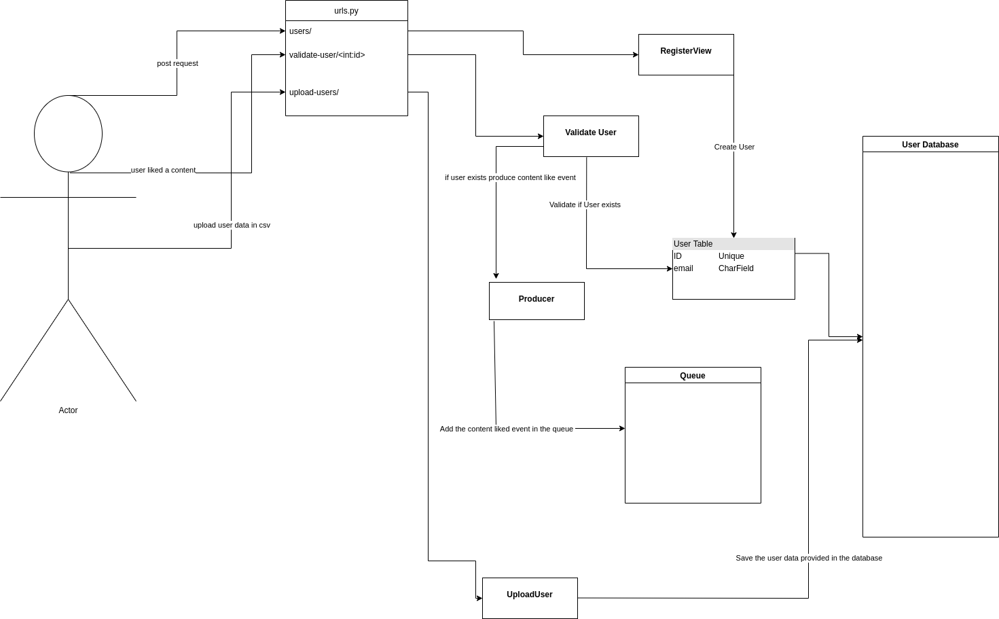

# Pratilipi

Pratilipi assignment

To start the project run: 

Step 1: cd to frontend

Step 2: npm install

Step 3: cd ..

Step 4: docker-compose up --build

Step 4: docker-compose exec user_app python manage.py migrate

Step 5: docker-compose exec content_app python manage.py migrate

Custom Data has been provided in Data folder.

To get documentaion:
http://localhost:8000/docs/
http://localhost:8001/docs/

High Level Desgin:

Low level design:

Content Service:

User-interaction Service:

Database Schema:

